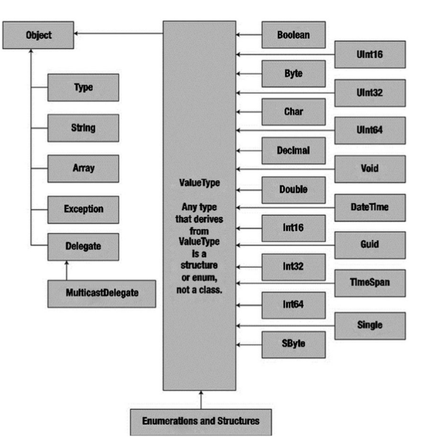

# C# Programming Language

C# is an object oriented, strongly typed programming language. It is a part of Microsoft .NET framework. 
To run C# .NET core SDKs must be installed.
A simple C# program is as follows:
```csharp
using System;

namespace SampleCSharpApp 
{
    class Program
    {
        static void Main(string[] args)
        {
            Console.WriteLine("Hello World!");
        }
    }
}
```
Every C# application must contain a class defining  ``` Main()``` method. This is the entry point of the application.
There are variations on the ``` Main() ``` method. Following codes  also can be used for method:
```csharp
// int return type, array of strings as the parameter.
static int Main(string[] args)
{
    //Must return a value before exiting
    return 0;
}

// No return type, no parameters
static void Main()
{

}

//int return type, no parameters 
static int Main()
{
    //Must return a value before exiting
    return 0;    
}

```

## Processing Command Line Arguments
---
As seen previously that  ```Main()``` method can have an argument as following  ```string[] args```. this ```args``` array of string contains the command line arguments. Following code shows print operation with command line arguments.
```csharp
static int Main(string[] args) 
{
    //Loop throug the args array using foreach
    foreach(string arg in args) 
    {
        Console.WriteLine("Arg: {0}", arg);
    }

    return 0;
}
```
Also, command-line arguments can be accessed using statc ```GetCommandLineArgs``` method of the ```System.Environment``` type. The return value if this method is an array of strings containing the arguments.
```csharp
using System;

namespace SampleCSharpApp 
{
    class Program
    {
        static void Main()
        {
            //Get the arguments using System.Environment
            string[] Args = Environment.GetCommandLineArgs();

            foreach(string arg in Args) 
            {
                Console.WriteLine("Arg: {0}", arg);
            }
        }
    }
}
```
## Basic Input Output with ```System.Console``` class
---
This class encapsulates input, output, and error-stream manipulations for console-based applications. The static methods that can be used to capture the input and output are the following:

| Function Name | Task        | 
| ------------- |:-------------:|
| ```Console.WriteLine()```  | Output a text string with newline characted in the end      | 
| ```Console.Write()``` | Output a text string without the newline character|
| ```Console.ReadLine()```| Reads the input stream until Enter key is pressed|
|```Console.Read()```| Read a single character from the input stream |

```csharp
class Program 
{
    static void Main(string[] args)
    {
        Console.WriteLine("This is a string.");
        Console.ReadLine();
    }
}
```
There are other methods  available in this class that can be used to manipulate the terminal.

### Formatting Console Output
---
Outputs can be formatted using the ```Console.WriteLine``` method. 

```csharp
/// prints -> Argument : 10
Console.WriteLine("Argument : {0}", 10);
/// prints -> 10, 20, 30
Console.WriteLine("{0}, {1}, {2}", 10, 20, 30);
```
Here in the method the first argument is the string that will be printed to the console. This string can contain place holders that can show additional data. `{}` is used as placeholder as seen in the examples. The first number of curly-bracket palce holder always begins with 0. And the remaining parameters are simply the values to be inserted into the respective placeholder.

### Formatting Numerical Data
---
Additional formatting also can be done to the numerical data.
| String Format Character | Meaning        | 
| ------------- |:-------------:|
|C or c| Used to format currency. By default ```$``` will be prefixed to the output |
|D or d| Used to format decimal numbers. Also may specify minimum padding value |
|E or e| Used for exponential notation. Casing controls the expoential constant. |
|F or f| Used for fixed-point formatting. Also may specify the minimum padding value.|
|G or g| Stands for *general*. This can be used to format fixed or expoenetial format. |
|N or n| Used for basic numerical formatting with commas. |
|X or x| Used for hexadecimal formatting. If you used and uppercase `X`, your hex format will also contain uppercase `X`|

This format character are suffixed to a given placeholder value using the colon token(e.g ```{0:C}```, ```{1:d}```, ```{2:X}```). 

```csharp
    /// outputs $99,999.00
    Console.WriteLine("c format : {0:c}", 99999);
    /// outputs 000099999
    Console.WriteLine("d9 format : {0:d9}", 99999);
    /// outputs 99999.000
    Console.WriteLine("f3 format : {0:f3}", 99999);
    /// outputs 99,999.00
    Console.WriteLine("n format : {0:n}", 99999);
    /// outputs 9.999900e+004
    Console.WriteLine("E format : {0:e}", 99999);
```
This type of formatting also can be done in other programs other than console applications. ```string.Format()``` method can help to format text data.
```csharp
    string msg = string.Format("99999 in hex is {0:x}", 99999);
```

## C# Data Types
---
C# is strongly typed programming language. So, it defines keywords for fundamental data types. These data types are defined in the ```System``` namespace. And most of them are  So every working C# program must use this namespace.  
C# is strongly typed programming language. So, it defines keywords for fundamental data types. These data types are defined in the ```System``` namespace. So every working C# program must use this namespace. And most of them are **Common Language Specification (CLS)** complaint. CLS-compliant .NET code can be used by any other .NET core programming languages like VB.NET or F#.

| C# name | CLS Compliant? | Meaning |
| ------------- |:-------------:|:-------------:|
|bool|Yes| Represents true or false|
|sbyte| No| Signed 8-bit number|
|byte| Yes| Unsigned 8-bit number|
|short|Yes| Signed 16-bit number|
|ushort|No| Unsigned 16-bit number|
|int | Yes| Signed 32-bit number|
|uint| No| Unsigned 32-bit number|
|long|Yes| Signed 64-bit number|
|ulong|No| Unsigned 64-bit number|
|char|Yes| Single 16-bit Unicode character |
|float| Yes| 32-bit floating-point number|
|double|Yes| 64-bit floating-point number|
|decimal| Yes| 128-bit signed number|
|string|Yes| Represents a set of Unicode characters|
|object|Yes| The base class of all types in the .NET framework|

Other than this data types, the ```System``` namespace defines a few useful data types for which there are no C# name/keyword. These are:
+ System.DateTime
+ System.TimeSpan
+ System.Guid
+ System.Void
  
## Variables and Constant Declaration 
---
Local variable declaration of C# is similar to C/C++. First the data type is declared and then the variable name follows.
```csharp
int myInt;
string str;
myInt = 0;
str = "This is a string";
bool b1 = true, b2 = false;
double d = 0.0;
```
In C#, there is ```default``` literal that can be used to assign a variable the default value for the data type. 
```csharp
int myInt = default;
```
Variables can be declared using ```new``` keyword also. This also sets the value of the variable to default value.

```csharp
bool b = new bool(); // Set to false.
DateTime dt = new new DateTime(); // Set to 1/1/0001 12:00:00 AM.
double d = new double(); // Set to 0.
```
### Constant declaration
---
Constants are declared with ```const``` modifier. Only the C# built-in types(excluding ```System.Object```) may be declared as ```const```. User defined types including classes, structs and arrays can't be const. Constants must be initialized as they are declared.
```csharp
public const int Months = 12;
```
### Implicitely Variable Declaration
---
In C#, it is possible to declare variable implicitely using ```var``` keyword. This can be used for any type of data.This has some restriction that are following:
+ This keyword can't be used to define return value, parameters, field data of custom type;
+ Variables declared with this keyword must be assigned values during declaration.
  
```csharp
// var variableName = initialValue;
var myInt = 0;
var myString = "A string";
//  Following results in compiler error.
class TestClass
{
    private var myInt = 0;
    public var MyMethod(var x, var y) {}
}

// Must assign a value during declaration otherwise compiler error.
var myVal;

<<<<<<< HEAD

```
Implicitely typed data is also strongly typed data. This is not same as the ```var``` in Javascript.
```csharp
// Following is permissible
var str = "test";
str = "new test"
// Following will produce error
str = 44;
```
### Class Hierarchy of Data Types
---


The numerical data types derive from a class named ```System.ValueType```. Descendants of this class are automatically allocated on the stack, and, therefor,e have a predictable lifetime and are quite efficient. Those types that don't belong to the ```System.ValueType``` are not allocated on the stack but on the garbage-collected heap. And all the .NET core data types are arranged in a class hierarchy. Each type is ultimately derived from the ```System.Object```, which also defines a set of methods that are common to all the types in the .NET core base class libraries.

### The ```System.Numerics``` namespace
---
This namespace defines a structure named ```BigInteger ```. This data type can be used to represent very big numerous values that are not constrained by a fixed upper or lower limit.
Also another structure ```Complex``` can model mathematically complex numerical data (eg. imaginary units, hyperbolic tangents).

## Working with Strings
---
```System.String``` provides a number of properties and methods to work with the strings. This methods can be accessed using dot operator. Also, there are static methods that can't be accessed this way. 
Some methods are following:
```csharp
string name = "Korim";
// outputs Name : Korim
Console.WriteLine("Name : {0}", name); 
// outputs Name Length : 5
Console.WriteLine("Name Length : {0}", name.Length) 
// outputs Name in uppercase : KORIM
Console.WriteLine("Name in uppercase : {0}", name.ToUpper());
// outputs Name in lowercase : korim
Console.WriteLine("Name in lowercase: {0}", name.ToLower());
// outputs Name contains o? : True
Console.WriteLine("Name contains o?: {0}", name.Contains("o"));
// outputs Name after replace : Rohim
Console.WriteLine("Name after replace: {0}", name.Replace("Kor", "Roh"));
// outputs Name : Korim
Console.WriteLine("Name : {0}", name); 
```
Here we can see that even after ```Replace()``` method the ```name``` isn't changed at all; rather a new string with the modified value was recieved as output. This is because the strings in C# are immutable. It means that the assigned to a variable can't be modified. 
### String interpolation
---
Other than the curly-brace syntax, string interpolation can be used to format string. This approach allows directly embedding variables in the strings, rather than tacking them on a comma-delimited list. In this method, the construction of strings begin with a dollar sign (```$```) prefix and still curly-brackets are used to mark a variable placeholder.
```csharp
// using curly-bracket syntax
string name = "Karim";
string greeting = string.Format("Hello {0}", name);
// using string interpolation syntax
string greeting2 = $"Hello {name}";
string greeting2 = $"Hello {name.ToUpper()}";
```
### The ```System.Text.StringBuilder``` Type
---
Like ```System.String``` class, the ```StringBuilder``` class defines methods that allows us to replace or fomart string segments. But unlike ```System.String``` , this can directly modfiy the object's internal character data efficietly.
```csharp
StringBuilder sb = new StringBuilder("A string");
// outputs -> A string
Console.WriteLine(sb);
sb.replace("A", "a");
// outputs -> a string
Console.WriteLine(sb);
```

## Data Type Conversion
---
Explicit type casting in C# can be applied using casting operator ```()```.
```csharp
short num1 = 30000;
short num2 = 50000;
// short data type can't hold the value of 80000. will overflow
//casting to int will ensure that no data is lost
//this is widening operation
int ans = (int)(num1 + num2);
```
Casting to larger data type is called widening and the opposite operation is called narrowing.

```csharp
int myInt = 200;
// this narrowing operation.
byte myByte = byte(myInt);
```
It is clear that value 200 can be stored in ```byte``` data type because it has an upperlimit of 256. Casting value greater than will cause overflow or data loss. C# provides two keywords that can detect data loss.
### The ```checked``` keyword
When a statement is wrapped with ```checked``` keyword, the C# compiler  test for overflow conditions. If overflow occurs, then it send a runtime execption: ```System.OverflowException.
```csharp
int b1 = 100;
int b2 = 250;

try
{
    checked
    {
        byte sum = (byte)(b1 + b2);
    }
}
catch (OverflowException ex)
{
    // outputs -> Arithmetic operation resulted in an overflow.
    Console.WriteLine(ex.Message);
}
```

### The ```unchecked``` keyword
---
This keyword cna disable the throwing of overflow exception on a case-by-case basis. This is identical to ```checked``` keyword.
```csharp
// Assuming checked is enabled
// this block will not trigger a runtime exception
unchecked
{
    byte sum = byte(b1 + b2);
}
```
## C# Iteration Constructs
There are several iteration statements available in C# which are similar to C/C++ or Java. These loops are:
1. ```for``` loop
2. ```foreach``` loop
3. ```while``` loop
4. ```do/while``` loop
   
Some examples:
### The ```for``` loop
---
```csharp
for(int i = 0; i < 4; i++)
{
    Console.WriteLine("Number is : {0}", i);
}
```
### The ```foreach``` loop
---
This allows us to iterate over items without the need to test for an upper limit. But, the ```foreach``` loop will only iterate in linear fasion. thus, we cannot go backword, skip elements.
```csharp
int[] myArr = {1, 3, 5, 6};
foreach(int i in myArr) 
{
    Console.WriteLine(i);
}
```
### The ```while ``` loop
---
```csharp
int i = 0;

while(i < 5) 
{
    Console.WriteLine(i);
    i++;
}
```
### The ```do/while ``` loop
---
```csharp
int i = 0;

do
{
    Console.WriteLine(i);
    i++;
} while(i < 5); //Semicolon is required.
```
## C# Control Flow Constructs
---
C# defines two constructs that can be used to control the flow of a program.
### The ```if/else``` statement
---
The ```if/else``` statement in C# is similar to that of the C/C++. But unlike C/C++, C# this statement in C# only operates on boolean expressions, not on values such as -1 or 0. Also, the equality/relational and logical operators are similar to the C/C++.
```csharp
string str = "test string";

if (str.Length > 0)
{
    Console.WriteLine("Length greater then 0");
}
else 
{
    Console.WriteLine("String is null");
}
```
The conditional operator (```?:```), also known as the ternary conditional operator, is a shorthand way of writing ```if/else``` statement.
```csharp
// condition ? first_expr : second_expr;
string str = "test string";
Console.WriteLine(str.Length > 0? 
    "Length greater then 0" : 
    "String is null");
```
But it has following restrictions.
+ Both types of ```first_expr``` and ``` second_expr``` must be the same.
+ The conditional operator can be used only in assignment statements.
```csharp
// this code will generate an error
str.Length > 0? 
    Console.WriteLine("Length greater then 0") : 
    Console.WriteLine("String is null");
```

### The ```switch``` statement
---
The C# ```switch``` statement is similar to the C/C++ ```switch``` statement. Each case that contains executable statements should have a terminating ```return```, ```break```, or ```goto``` to avoid falling through the nex statement. C# ```switch``` statement can evaluate ```int```, ```char```, ```string```, ```bool```, ```enum``` data types.

```csharp
var foo = 5;

switch (foo)
{
    case 1:
    // do something
    break;
    case 2;
    // do something
    goto default;
    default:
    // default action
    break;
}
```
## C# Arrays
---
An array is a set of data items of same type that can be accessed using a numerical index. There are various ways for initializing C# arrays. If the declared variables are not filled with values, then each index will be filled with default value of that data type. They are following:
```csharp
int[] myInts = new int[3];
// Array initialization syntax using the new keyword.
string[] stringArr = new string[] { "one", "two", "three"};
//Array initialization without the new keyword.
bool[] boolArr = {false, true, false};
// Array initialization with new keyword and size
// size must match the number of element in the array.
int[] intArr = new int[4] {1, 2, 3, 4};
// new keyword must be used when declaring implicitely type array.
// items must be of same type
var[] a = new[] {1, 10, 100, 1000};
```

It is clear that, C# array items are of same type. Values of different types in same array will cause compiler error. But ```System.Object``` data type can be used to create an array that accomodates values of different types.

```csharp
object[] myObjs = new Object[4];
myObjs[0] = 10;
myObjs[1] = false;
myObjs[2] = new DateTime(2000, 3, 26);
myObjs[3] = "a string";
```
### C# Multidimensional Arrays
---
C# supports two varieties of multidimensional arrays. First one of them is ***rectengular array***, which is simply an array of multiple dimensions where each is of same length.
```csharp
// Rectengular Array
int[,] myMatrix;
myMatrix = new int[3, 4];
// Populate (3 * 4) array.
for(int i = 0; i < 3; i++)
{
    for(int j = 0; j < 4; j++)
    {
        myMatrix[i, j] = i * j;
    }
}
```
The second type of multidimensional array is called ***jagged array***. This type of arrays contains some number of inner arrays, each of which may have a different upper limit.
```csharp
// Jagged Array
int[][] myJagArray;
myJagArray = new int[5][];

// Create jagged array.
for (int i = 0; i < myJagArray.Length; i++) 
{
    myJagArray[i] = new int[i + 7];
}

// Print each row
for (int i = 0; i < myJagArray.Length; i++)
{
    for (int j = 0; j < myJagArray[i].Length; j++)
    {
        Console.Write(myJagArray[i][j] + " ");
    }
}
```
### Indice and Ranges
---
TO simplify working with sequences, C# 8 introduces two new types and two new operators for use:
+ ```System.Index``` represents an index into sequence.
+ ```System.Range``` represents a subrange of indices.
+ The index from end operator ```^``` specifies that the index is relative to the end of the sequence.
+ The range operator (```...```) specifies the start and end of a range as its operands.
  
Example for ```System.Index``` is following:
```csharp
for (int i = 0; i < arr.Length; i++)
{
    Index idx = i;
    Console.WriteLine("{0}", arr[idx]);
}
```
The index from end operator lets us specify how many positions from the end of sequence, starting with the length. The last item in a sequence is one less than the actual length, so ^0 would actually cause an error. Following code prints the array in reverse.

```csharp
for (int i = 1; i <= arr.Length; i++)
{
    Index idx = ^i;
    Console.WriteLine("{0}", arr[idx]);
}
```

The range operator like python specifies a start and end index, and allows for access to a sub-sequence within a list.
```csharp
int arr[] = {1, 2, 4, 5, 6, 7};

// Loop prints -> 1, 2, 4
foreach(var i in arr[0..4])
{
    Console.Write(i + ", ");
}
```
The range also can be declared as follows:
```csharp
Range r = 0..4;
int arr[] = {1, 2, 4, 5, 6, 7};

// Loop prints -> 1, 2, 4
foreach(var i in arr[r])
{
    Console.Write(i + ", ");
}
```

